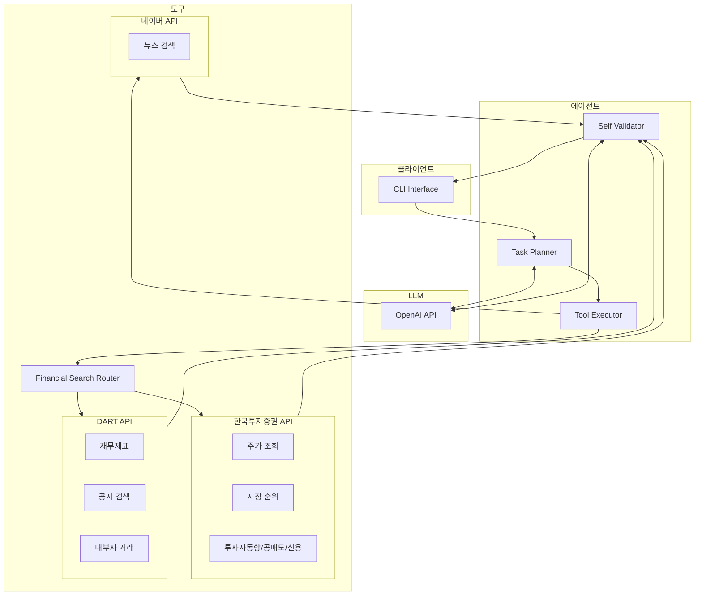

# Dexter for Korean Market

한국 주식 시장 분석을 위한 자율 금융 리서치 에이전트입니다. 한국투자증권 API, DART API, 네이버 검색 API를 활용하여 KOSPI/KOSDAQ 종목에 대한 종합적인 분석을 수행합니다.

> 이 프로젝트는 [virattt/dexter](https://github.com/virattt/dexter)를 포크하여 한국 주식 시장 분석용으로 개조한 것입니다.

## 주요 기능

### 데이터 소스
- **한국투자증권 (KIS)**: 실시간 시세, 일별 주가, 시장 순위, 투자자별 매매동향, 공매도, 신용잔고
- **DART**: 재무제표 (손익계산서, 재무상태표, 현금흐름표), 공시 검색, 내부자 거래
- **네이버**: 한국어 뉴스 검색

### 지원 기능
| 기능 | 설명 | 데이터 소스 |
|------|------|------------|
| 주가 조회 | 현재가, 과거 시세 | KIS |
| 재무제표 | 손익계산서, 재무상태표, 현금흐름표 | DART |
| 공시 검색 | 사업보고서, 분기보고서, 주요사항보고 | DART |
| 내부자 거래 | 임원/주요주주 지분 변동 | DART |
| 시장 순위 | 상승률, 하락률, 거래량 순위 | KIS |
| 투자자 매매동향 | 외국인/기관/개인 수급 | KIS |
| 공매도 | 공매도량, 공매도잔고 | KIS |
| 신용잔고 | 신용융자, 대주잔고 | KIS |
| 뉴스 검색 | 기업/종목 관련 뉴스 | 네이버 |

## 사전 요구사항

- [Bun](https://bun.sh) 런타임 (v1.0 이상)
- OpenAI API 키 ([발급](https://platform.openai.com/api-keys))
- 한국투자증권 Open API 키 ([발급](https://apiportal.koreainvestment.com))
- DART Open API 키 ([발급](https://opendart.fss.or.kr))
- 네이버 검색 API 키 ([발급](https://developers.naver.com)) - 선택사항

## 설치

1. 저장소 클론:
```bash
git clone https://github.com/your-repo/dexter-for-korean-market.git
cd dexter-for-korean-market
```

2. 의존성 설치:
```bash
bun install
```

3. 환경 변수 설정:
```bash
cp env.example .env
```

`.env` 파일을 편집하여 API 키를 설정:

```bash
# LLM API
OPENAI_API_KEY=your-api-key

# 한국투자증권 (필수)
KIS_APP_KEY=your-app-key
KIS_APP_SECRET=your-app-secret
KIS_ACCOUNT_NO=12345678
KIS_ACCOUNT_PROD=01
KIS_ENV=prod

# DART (필수)
DART_API_KEY=your-api-key

# 네이버 검색 (선택)
NAVER_CLIENT_ID=your-client-id
NAVER_CLIENT_SECRET=your-client-secret
```

## 실행

### 인터랙티브 모드

```bash
bun start
```

CLI에서 직접 질문을 입력하고 답변을 받는 모드입니다. 실제 사용 시 이 모드를 사용합니다.

- `>` 프롬프트에서 질문 입력
- 에이전트가 필요한 도구를 자동으로 선택하여 데이터 조회
- 결과를 종합하여 답변 생성
- `exit` 또는 `Ctrl+C`로 종료

### 개발 모드

```bash
bun dev
```

코드 변경 시 자동으로 재시작되는 watch 모드입니다. 개발 중 사용합니다.

- 파일 변경 감지 시 자동 재실행
- 빠른 피드백 루프로 개발 효율 향상

## 사용 예시

```
> 삼성전자 현재 주가와 PER 알려줘

삼성전자(005930)의 현재가는 72,300원입니다.
- 전일대비: +800원 (+1.12%)
- PER: 15.2배
- PBR: 1.28배
- 거래량: 12,345,678주

> SK하이닉스의 2023년 재무제표 분석해줘

SK하이닉스(000660)의 2023년 재무현황입니다.

**손익계산서**
- 매출액: 32조 7,655억원
- 영업이익: -7조 7,297억원 (적자)
- 당기순이익: -9조 1,292억원

**재무상태표**
- 자산총계: 95조 3,201억원
- 부채총계: 38조 5,892억원
- 자본총계: 56조 7,309억원

> 외국인이 최근 삼성전자를 얼마나 샀어?

최근 30일간 외국인 순매수 현황:
- 누적 순매수: +1,234만주
- 평균 일 순매수: +41만주
- 최근 5일: 4일 순매수, 1일 순매도
```

## 평가

에이전트의 성능을 측정하는 평가 스위트입니다. LLM-as-judge 방식으로 답변의 정확성을 채점합니다.

### 전체 데이터셋 실행

```bash
bun run src/evals/run.ts
```

### 샘플 실행

```bash
bun run src/evals/run.ts --sample 10
```

무작위로 10개 질문만 선택하여 빠르게 테스트합니다.

### 평가 데이터셋

`src/evals/dataset/finance_agent_kr.csv`에 한국 시장용 테스트 질문이 포함되어 있습니다:

- 주가 조회 (삼성전자 현재가, PER 등)
- 재무제표 분석 (매출, 영업이익, 재무상태)
- 투자자 매매동향 (외국인, 기관 수급)
- 공시 검색 및 요약
- 복합 질문 (비교 분석, 계산)

### 결과 확인

실행 중 실시간으로 진행 상황과 정확도가 표시됩니다.

## 아키텍처



### 동작 흐름

1. **질문 입력**: 사용자가 CLI에서 자연어로 질문
2. **태스크 계획**: LLM이 질문을 분석하여 필요한 도구와 순서 결정
3. **도구 실행**: Financial Search Router가 적절한 API 호출
4. **결과 검증**: 수집된 데이터의 완전성 검증, 필요시 추가 조회
5. **답변 생성**: 검증된 데이터를 종합하여 최종 답변 생성

## 프로젝트 구조

```
src/
├── agent/                 # 에이전트 코어
│   └── prompts.ts        # 한국어 프롬프트
├── tools/
│   ├── finance/
│   │   ├── kis/          # 한국투자증권 API
│   │   │   ├── auth.ts   # OAuth 인증
│   │   │   ├── prices.ts # 주가 조회
│   │   │   ├── market.ts # 시장 순위
│   │   │   └── korea-specific.ts  # 공매도, 수급 등
│   │   ├── dart/         # DART API
│   │   │   ├── fundamentals.ts   # 재무제표
│   │   │   ├── disclosures.ts    # 공시 검색
│   │   │   ├── insider.ts        # 내부자 거래
│   │   │   └── corp-code.ts      # 종목코드 매핑
│   │   └── financial-search.ts   # 라우터
│   └── search/
│       └── naver.ts      # 네이버 뉴스 검색
└── evals/
    └── dataset/
        └── finance_agent_kr.csv  # 한국 시장 평가셋
```

## API 제한사항

- **한국투자증권**: 초당 20회 호출 제한
- **DART**: 일 10,000건 무료
- **네이버**: 일 25,000건 무료

## 라이선스

MIT License
